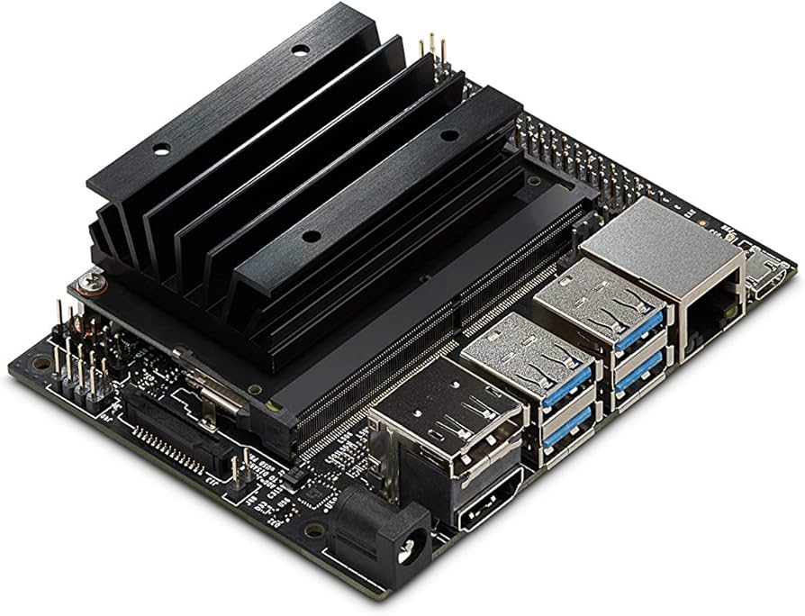
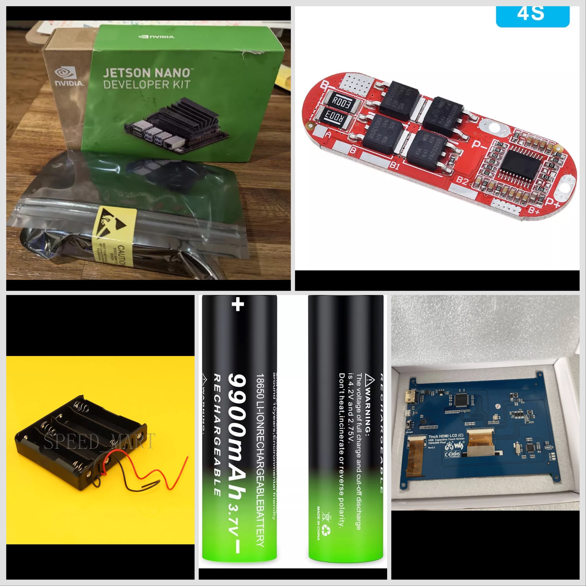

# Mr. CrackBot AI

> **Status**: 🚧 In its infancy – Not yet released!

Welcome to **Mr. CrackBot AI**, a cutting-edge tool designed for automated Wi-Fi penetration testing and password cracking. This README  describes the current functionality and also tracks the evolution of the project.

---

## 🚀 Features🥷🏻🤖🔥🔥🔥📡👾👾👾👾👾👾👾👾👾
Here’s what Mr. CrackBot AI aims to accomplish:
- **AI-Powered Wordlist Generation**: Uses machine learning to generate highly optimized password guesses based on network metadata.
- **Automated WPA Handshake Capture**: Scans networks and captures WPA/WPA2 handshakes with minimal user input. Working on attempting WPA3...
- **GPU-Accelerated Cracking**: Leverages NVIDIA GPUs and tools like `hashcat` for "lightning-fast"⚡️💤💤💤💾📡👾password cracking.
- **Interactive User Interface**: Provides real-time updates on cracking progress and network analysis.

---


## 🛠️ Hardware Requirements

To run Mr. CrackBot AI, you’ll need:
- **NVIDIA Jetson Nano (4GB)**:
  - A small yet powerful AI development board.
- **Wi-Fi Adapter**:
  - Capable of monitor mode (e.g., ALFA AWUS036ACH).
- **NVIDIA GPU** (optional):
  - Enhances cracking speed if using external hardware. Its an idea I'm toying with
- **SD Card**:
  - Minimum 32GB with Mr. CrackBot AI ISO installed.

## 🎬 Here's a techie (Jeff Geerling) running dedicated GPU Graphics cards into a Raspberry Pi SBC, so it's possible😉

   https://youtu.be/l9dItRUjQ0k?si=c9cU1-5ZtTJfR4si


---

## 🛤️ Development Timeline

### **Phase 1: Conceptualization**
- **Initial Idea** As it began, I blindly created several rough draft firmwares for an ESP device called the Cheap Yellow Display with the simple aim of runnning a much shorter wordlist in an auto function mode against any listed ap selected. Nope!!!🥲🤬🤮Lol! Turning my eyes to the web I researched the smallest, most powerful SBC's capable of password list cracking, and found the NVIDIA JETSON NANO!
- **Key Focus**:
  - Leveraging the GPU for AI-driven password cracking.
  - Using wordlists like `rockyou2024.txt` and `SecLists` for cracking WPA/WPA2 passwords.

---

### **Phase 2: Core Functionality Development**
- **AI Wordlist Generation**:
  - Integrated an AI model to generate customized password guesses based on SSID and BSSID metadata.
- **Handshake Capture**:
  - Automated handshake capturing using tools like `airodump-ng` and `aireplay-ng`.
- **Deauthentication Attacks**:
  - Added functionality to force client reconnections for handshake collection.

---

### **Phase 3: Hardware Integration**
- **Jetson Nano**:
  - Optimized the project for the Jetson Nano, ensuring compatibility with its hardware constraints.
- **Wi-Fi Adapter Setup**:
  - Tested and verified monitor mode compatibility with various adapters.
- **GPU Utilization**:
  - Integrated `hashcat` for GPU-accelerated cracking.

---

### **Phase 4: Interactive User Interface**
- **UI Design**:
  - Added a user-friendly interface for monitoring networks, handshake capture, and cracking progress.
- **Real-Time Updates**:
  - Enabled live tracking of handshake capture status and cracking progress in the UI.

---

### **Phase 5: Configuration Initialization**
- **Error Handling**:
  - Ensured the project validates required tools (e.g., `airodump-ng`, `aireplay-ng`, `hashcat`) before starting.
- **Directory Setup**:
  - Automated the creation of necessary directories (e.g., `data/wordlists`, `data/captures`) during initialization.

---

## 🧠 How It Works
1. **Scanning Networks**:
   - The system uses `airodump-ng` to discover nearby Wi-Fi networks and identifies potential targets.

2. **Capturing Handshakes**:
   - Handshakes are captured using deauthentication attacks (`aireplay-ng`) and stored for analysis.

3. **AI-Powered Wordlists**:
   - Based on network metadata (SSID, BSSID), the AI generates custom wordlists optimized for cracking.

4. **GPU Cracking**:
   - The generated wordlist is run through `hashcat` for GPU-accelerated password cracking.


## 👀 Link to the official ROCKYOU2024.txt file: https://www.kaggle.com/datasets/bwandowando/original-rockyou2024-text-file-11-parts

---

## 🛠️ Installation
To set up Mr. CrackBot AI:
1. Clone the repository:
   ```bash
   git clone https://github.com/yourusername/mr-crackbot-ai.git
   cd mr-crackbot-ai

	2.	Install dependencies:

pip install -r requirements.txt


	3.	Flash the ISO to your SD card and boot your Jetson Nano.

⚠️ Disclaimer

This project is for educational purposes only. Use responsibly and only on networks you own or have permission to test.

🤝 Contributing

Contributions are welcome! Here’s how you can help:
	•	Open issues for bugs or feature requests.
	•	Submit pull requests for new features.

📜 License

This project is licensed under the MIT License.

📊 Project Status... working on integrating a  Waveshare 7inch HDMI LCD (H) 1024×600 touchscreen. Opens a can of worms!!!!📡🚧💾🤖☠️👺👾🥷🏻

---

🔧 Upcoming Hardware Testing & Debugging 🚀

Mr. CrackBot AI is entering its testing phase! 🧪 The spotlight is now on fine-tuning hardware integration and tackling critical debugging tasks. Powered by the NVIDIA Jetson Nano 🖥️, the upcoming tests will verify compatibility with essential hardware, including the ALFA AWUS036ACH Wi-Fi adapter 📡 (monitor mode & packet injection) and optional external NVIDIA GPUs ⚡ for blazing-fast password cracking.

The AI-powered wordlist generation 🤖 and handshake analysis pipelines will also undergo rigorous testing. The handshake capture process, which uses airodump-ng 📋 and aireplay-ng 🎯 for deauthentication attacks, will be debugged to ensure reliable operation across diverse environments. Once captured, handshakes are fed into hashcat 🚀 for GPU-accelerated cracking, optimized with custom AI-generated wordlists 🧠.

On the front end, efforts will focus on streamlining the user interface 🖱️ and providing real-time feedback 📊 for monitoring network analysis and cracking progress. Additional debugging will address directory setups, dependency validation, and error-handling mechanisms to ensure a seamless user experience.

Stay tuned! 🔥 Mr. CrackBot AI is one step closer to becoming a polished, powerful tool for automated penetration testing and password cracking. 💪Here’s the updated hardware list with prices included for each item:

## Hardware Components 🛠️

---




	1.	NVIDIA Jetson Nano 4GB Kit
	•	Model: 945-13450-0000-000
	•	Price: $135.00
	•	Description: The brain of the operation, this AI development board provides GPU-accelerated processing for CrackBot AI’s tasks. It runs Python scripts efficiently and handles AI workloads for tasks like password cracking and Wi-Fi network analysis.
	2.	WaveShare 7-inch HDMI LCD Touchscreen
	•	Model: 1024x600 USB Capacitive Touch Screen (H)
	•	Price: $42.00
	•	Description: This display is the primary interface for CrackBot AI, allowing you to interact with the software via touch. It connects via HDMI for video and USB for touch input.
	3.	18650 Battery Holder (4 Slots)
	•	Model: High-Quality 18650 x4 Battery Storage Clip with 15cm Lead
	•	Price: $2.49
	•	Description: Provides portable power for your setup. Holds four 18650 batteries and connects to the DC power converter to regulate power output.
	4.	18650 3.7V Rechargeable Li-ion Batteries 🔋
	•	Model: 3.7V Li-ion Batteries (x4)
	•	Price: $10.00 (estimated total for 4 batteries)
	•	Description: The primary power source for CrackBot AI. These rechargeable batteries provide a steady power supply for extended use.
	5.	4S 18650 Battery Protection Circuit
	•	Model: 4PC 3S 4S 5S BMS 25A Li-ion Battery Protection Board
	•	Price: $11.43
	•	Description: Ensures safe charging and discharging of the 18650 batteries. Protects against overcharge, over-discharge, and short circuits.
	6.	XL4015 5A Buck DC-DC Power Converter
	•	Model: Step Down Converter with Voltage Current Display
	•	Price: $8.79
	•	Description: Regulates voltage from the battery pack to supply a stable 5V output for the Jetson Nano and other components.
	7.	HDMI Cable
	•	Model: Ultra-Slim High-Speed HDMI 2.0 Cord (1.5ft)
	•	Price: $8.49
	•	Description: Connects the Jetson Nano to the WaveShare touchscreen for video output.
	8.	16.8V 2A AC/DC Charger
	•	Model: Adapter for 4S 18650 Li-ion Battery Pack
	•	Price: $7.55
	•	Description: Charges the 18650 battery pack to ensure uninterrupted operation.
	9.	TP-Link USB Wi-Fi Adapter
	•	Model: AC600Mbps Archer T2U Plus
	•	Price: $12.99
	•	Description: Provides Wi-Fi connectivity for CrackBot AI, enabling network scanning and interaction.

Total Estimated Cost: ~$238.74

Assembly Instructions ⚙️

	1.	Prepare the Power System 🔋
	•	Insert 4 x 18650 3.7V Li-ion rechargeable batteries into the battery holder.
	•	Connect the battery holder’s output to the 4S BMS protection circuit.
	•	Connect the BMS output to the XL4015 DC-DC converter. Adjust the voltage output to 5V for the Jetson Nano.
	2.	Set Up the Jetson Nano 🤖
	•	Install the Jetson Nano on its carrier board.
	•	Connect the DC-DC converter output to the Nano’s power input.
	3.	Attach the WaveShare Touchscreen 🖥️
	•	Connect the HDMI cable from the Jetson Nano to the touchscreen.
	•	Plug the touchscreen’s USB cable into the Jetson Nano for touch input.
	4.	Connect the Wi-Fi Adapter 🌐
	•	Plug the TP-Link USB Wi-Fi adapter into one of the Jetson Nano’s USB ports.
	5.	Charge the Battery Pack ⚡
	•	Use the 16.8V AC/DC charger to fully charge the 18650 batteries before initial use.
	6.	Power Up and Test 🚀
	•	Switch on the power system and boot the Jetson Nano.
	•	Confirm the touchscreen, Wi-Fi adapter, and other components are functioning.

Cool Features and Notes 📝

	•	Portable Power: With the 18650 rechargeable batteries, CrackBot AI is ideal for field testing.
	•	Touchscreen Interface: The WaveShare display allows for direct interaction with CrackBot AI’s tools.
	•	Wi-Fi Analysis: The TP-Link adapter supports scanning and deauthentication features.


